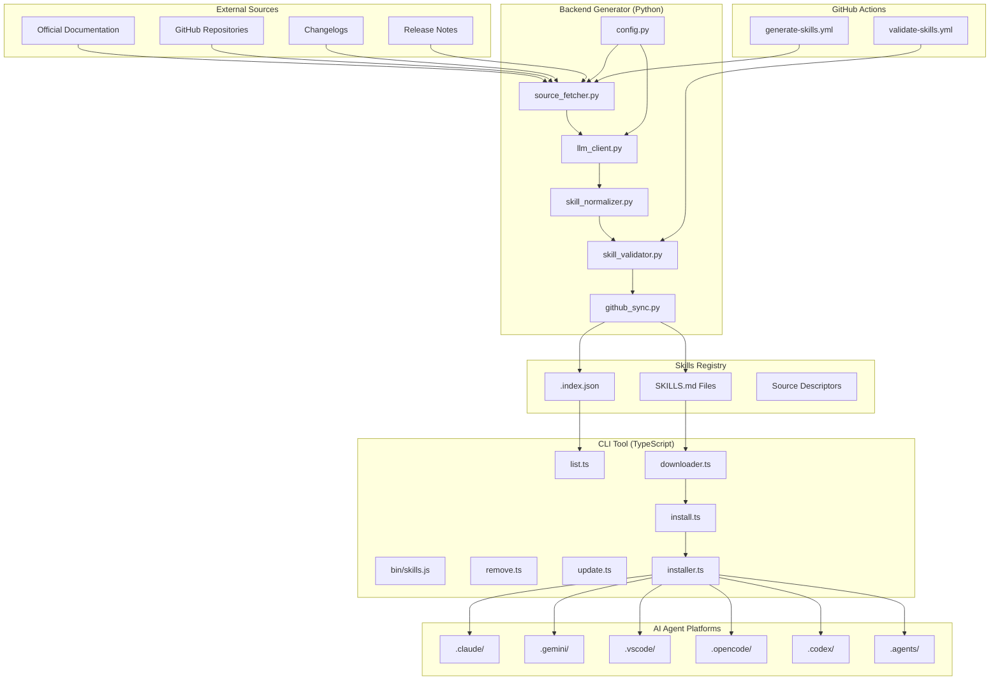

# AI-Skills Architecture

## Overview

The AI-Skills system is a monorepo-based platform that automatically generates, validates, and distributes production-grade SKILLS.md files for AI agents. The system consists of three main components:

1. **Backend Generator** (Python) - Fetches documentation, normalizes content via LLM, and validates skills
2. **Skills Registry** - Stores curated SKILLS.md files and metadata
3. **CLI Tool** (TypeScript) - Installs and manages skills across AI agent platforms

## System Diagram



## Component Interactions

### 1. Documentation Fetching Flow

```
Source URLs → source_fetcher.py → Raw Content → Snapshots
```

The [`source_fetcher.py`](../backend/python/source_fetcher.py) module:

- Fetches content from multiple source types (URLs, GitHub API, changelogs)
- Stores raw content in [`backend/snapshots/`](../backend/snapshots/) for diffing
- Only sends changed content to LLM (delta-based efficiency)
- Supports HTML, Markdown, and JSON formats

### 2. LLM Normalization Flow

```
Raw Content → llm_client.py → skill_normalizer.py → Normalized JSON
```

The [`llm_client.py`](../backend/python/llm_client.py) module:

- Provider-agnostic LLM integration (supports any OpenAI-compatible API)
- Configurable via [`config.py`](../backend/python/config.py) with `base_url`, `api_key`, and `model`
- Implements retry logic with exponential backoff
- Caches responses to reduce token usage

The [`skill_normalizer.py`](../backend/python/skill_normalizer.py) module:

- Enforces JSON schema compliance
- Applies clarity rules (rejects vague statements)
- Deduplicates items across sections
- Enforces section limits (Rules: 10, Patterns: 10, Anti-Patterns: 5, etc.)

### 3. Validation Flow

```
Normalized JSON → skill_validator.py → ValidationResult
```

The [`skill_validator.py`](../backend/python/skill_validator.py) module:

- Validates against JSON schema from [`SKILL_SPEC.md`](./SKILL_SPEC.md)
- Checks for duplicates across sections
- Enforces clarity with regex patterns
- Validates URLs in Sources
- Ensures ISO 8601 format for timestamps

### 4. GitHub Sync Flow

```
Validated Skills → github_sync.py → Git Commit → Registry
```

The [`github_sync.py`](../backend/python/github_sync.py) module:

- Reads updated skills from [`packages/skills-registry/`](../packages/skills-registry/)
- Creates branch: `generate/skills-{timestamp}`
- Commits with message: `docs(skills): auto-generate {skill-name} from {sources}`
- Pushes and optionally creates PR

### 5. CLI Installation Flow

```
User Command → bin/skills.js → Command Handler → downloader.ts → installer.ts → Agent Folders
```

The CLI command flow:

1. **Install**: `npx @emmraan/ai-skills react`
   - [`install.ts`](../packages/cli/src/commands/install.ts) fetches SKILLS.md from registry
   - [`downloader.ts`](../packages/cli/src/core/downloader.ts) downloads via GitHub raw content
   - [`installer.ts`](../packages/cli/src/core/installer.ts) places files in agent folders
   - Updates [`.skill-lock.json`](../.skill-lock.json) with metadata

2. **List**: `npx @emmraan/ai-skills list`
   - [`list.ts`](../packages/cli/src/commands/list.ts) shows installed and available skills
   - Reads from [`.skill-lock.json`](../.skill-lock.json) and registry

3. **Remove**: `npx @emmraan/ai-skills remove react`
   - [`remove.ts`](../packages/cli/src/commands/remove.ts) deletes from all agent folders
   - Updates [`.skill-lock.json`](../.skill-lock.json)

4. **Update**: `npx @emmraan/ai-skills update`
   - [`update.ts`](../packages/cli/src/commands/update.ts) checks for newer versions
   - Reinstalls skills if updates available

## Data Flow

### Complete Generation Pipeline

```
┌─────────────────────────────────────────────────────────────────┐
│ 1. Source Fetching                                              │
├─────────────────────────────────────────────────────────────────┤
│ • Fetch from URLs, GitHub API, changelogs                       │
│ • Store in backend/snapshots/{skill}.txt                        │
│ • Compare with previous snapshot (diff)                         │
└─────────────────────────────────────────────────────────────────┘
                              ↓
┌─────────────────────────────────────────────────────────────────┐
│ 2. LLM Normalization (only if content changed)                  │
├─────────────────────────────────────────────────────────────────┤
│ • Send delta content to LLM                                     │
│ • Apply system prompt for JSON structure                        │
│ • Receive NormalizedSkill JSON                                  │
└─────────────────────────────────────────────────────────────────┘
                              ↓
┌─────────────────────────────────────────────────────────────────┐
│ 3. Validation                                                   │
├─────────────────────────────────────────────────────────────────┤
│ • Validate against SKILL_SPEC schema                            │
│ • Check for duplicates and vague language                       │
│ • Validate URLs and timestamps                                  │
└─────────────────────────────────────────────────────────────────┘
                              ↓
┌─────────────────────────────────────────────────────────────────┐
│ 4. Markdown Generation                                          │
├─────────────────────────────────────────────────────────────────┤
│ • Convert JSON to SKILLS.md format                              │
│ • Add YAML frontmatter                                          │
│ • Write to packages/skills-registry/skills/{name}/SKILLS.md     │
└─────────────────────────────────────────────────────────────────┘
                              ↓
┌─────────────────────────────────────────────────────────────────┐
│ 5. Registry Update                                              │
├─────────────────────────────────────────────────────────────────┤
│ • Update .index.json with metadata                              │
│ • Commit and push to repository                                 │
└─────────────────────────────────────────────────────────────────┘
```

### CLI Installation Pipeline

```
┌─────────────────────────────────────────────────────────────────┐
│ 1. User Command                                                 │
├─────────────────────────────────────────────────────────────────┤
│ • npx @emmraan/ai-skills <skill>                                         │
│ • Parse arguments and route to command handler                  │
└─────────────────────────────────────────────────────────────────┘
                              ↓
┌─────────────────────────────────────────────────────────────────┐
│ 2. Registry Lookup                                              │
├─────────────────────────────────────────────────────────────────┤
│ • Fetch .index.json from registry                               │
│ • Check if skill exists and get version                         │
└─────────────────────────────────────────────────────────────────┘
                              ↓
┌─────────────────────────────────────────────────────────────────┐
│ 3. Download                                                     │
├─────────────────────────────────────────────────────────────────┤
│ • Download SKILLS.md from GitHub raw content                    │
│ • Calculate hash for change detection                           │
└─────────────────────────────────────────────────────────────────┘
                              ↓
┌─────────────────────────────────────────────────────────────────┐
│ 4. Installation                                                 │
├─────────────────────────────────────────────────────────────────┤
│ • Create directories in agent folders                           │
│ • Write SKILLS.md to each location                              │
│ • Create .skill-metadata.json                                   │
└─────────────────────────────────────────────────────────────────┘
                              ↓
┌─────────────────────────────────────────────────────────────────┐
│ 5. Lockfile Update                                              │
├─────────────────────────────────────────────────────────────────┤
│ • Update .skill-lock.json with hash, timestamp, version         │
└─────────────────────────────────────────────────────────────────┘
```

## File Structure

```
ai-skillls/
├── .github/workflows/
│   ├── generate-skills.yml    # Weekly skill generation
│   └── validate-skills.yml    # PR validation
├── backend/
│   ├── python/
│   │   ├── main.py            # Orchestrator
│   │   ├── llm_client.py      # LLM API client
│   │   ├── source_fetcher.py  # Documentation fetcher
│   │   ├── skill_normalizer.py # LLM prompt + JSON parsing
│   │   ├── skill_validator.py # Schema validation
│   │   ├── github_sync.py     # Git operations
│   │   ├── config.py          # Environment configuration
│   │   └── tests/             # Unit tests
│   ├── sources/               # Source descriptor JSON files
│   └── snapshots/             # Cached raw content
├── docs/
│   ├── SKILL_SPEC.md          # SKILLS.md specification
│   ├── ARCHITECTURE.md        # This file
│   └── EXTENDING.md           # Extension guide
├── packages/
│   ├── cli/                   # NPX CLI tool
│   │   ├── bin/skills.js      # Entry point
│   │   └── src/
│   │       ├── commands/      # CLI commands
│   │       ├── core/          # Core functionality
│   │       └── utils/         # Utilities
│   ├── skills-registry/       # Published skills
│   │   └── skills/
│   │       ├── react/SKILLS.md
│   │       ├── vue/SKILLS.md
│   │       └── ...
│   └── shared-types/          # TypeScript interfaces
├── plans/                     # Phase documentation
└── README.md                  # Root documentation
```

## Key Design Decisions

### Provider-Agnostic LLM

The system uses a configurable `base_url` and optional `api_key` to support any OpenAI-compatible API:

- **Anthropic**: `https://api.anthropic.com/v1`
- **OpenAI**: `https://api.openai.com/v1`
- **Gemini**: `https://generativelanguage.googleapis.com/v1beta`
- **Local LLMs**: `http://localhost:11434/v1` (Ollama)

This design prevents vendor lock-in and allows easy switching between providers.

### Diff-Based LLM Calls

Raw content is stored in [`backend/snapshots/`](../backend/snapshots/) before generation. Only changed content is sent to the LLM, significantly reducing token usage and costs.

### Monorepo Structure

All components live in a single pnpm workspace:

- Simplifies version management
- Shared types via [`packages/shared-types/`](../packages/shared-types/)
- Coordinated releases across CLI and registry
- Single source of truth for skills

### GitHub Raw Distribution

Skills are distributed via `raw.githubusercontent.com` instead of npm:

- No need for npm publish registry
- Direct file delivery from repository
- Simpler access control
- Instant updates without version bumps

## Configuration

### Environment Variables

| Variable           | Description                 | Required | Default |
| ------------------ | --------------------------- | -------- | ------- |
| `LLM_BASE_URL`     | LLM API base URL            | Yes      | -       |
| `LLM_API_KEY`      | LLM API key                 | No\*     | -       |
| `LLM_MODEL`        | Model name                  | Yes      | -       |
| `GITHUB_TOKEN`     | GitHub token for API access | Yes      | -       |
| `GITHUB_ORG`       | GitHub organization         | Yes      | -       |
| `UPDATE_FREQUENCY` | Update schedule             | No       | weekly  |

\*Some providers (like local LLMs) don't require an API key.

### CLI Configuration

The CLI reads configuration from:

1. **Agent folders** (hardcoded in [`config.ts`](../packages/cli/src/core/config.ts)):
   - `.claude/`
   - `.gemini/`
   - `.vscode/`
   - `.opencode/`
   - `.codex/`
   - `.agents/`

2. **Registry URL** (default):
   - `https://raw.githubusercontent.com/Emmraan/ai-skills/main/packages/skills-registry/`

3. **Lockfile** (`.skill-lock.json`):
   - Tracks installed skills, versions, and hashes

## Security Considerations

1. **API Keys**: Stored as GitHub Secrets, never committed
2. **Content Sanitization**: All fetched content is validated before processing
3. **URL Validation**: All source URLs are validated before inclusion
4. **Git Commits**: Bot commits use GitHub Actions identity
5. **Input Validation**: All user inputs are validated against schemas

## Performance Optimization

1. **Delta Processing**: Only changed content is sent to LLM
2. **Response Caching**: LLM responses are cached to avoid duplicate calls
3. **Parallel Fetching**: Multiple sources are fetched concurrently
4. **Lazy Loading**: CLI only downloads skills when requested
5. **Hash-Based Detection**: Skills are only reinstalled if content changes

## Extensibility

The system is designed for easy extension:

- **New Skills**: Add source descriptor JSON in [`backend/sources/`](../backend/sources/)
- **New Agent Platforms**: Add to agent folders list in [`config.ts`](../packages/cli/src/core/config.ts)
- **New LLM Providers**: Configure via `base_url` in [`.env`](../.env.example)
- **Custom Prompts**: Modify system prompt in [`skill_normalizer.py`](../backend/python/skill_normalizer.py)

See [`EXTENDING.md`](./EXTENDING.md) for detailed extension guides.
